# Storybook Visual Regression

A comprehensive visual regression testing tool for any Storybook project.

## Monorepo Structure

This repository is organized as a monorepo with two main packages:

- **`./cli`** - The CLI tool (`@storybook-visual-regression/cli`)
- **`./addon`** - The Storybook addon (`@storybook-visual-regression/addon`)

## Quick Start

### CLI Tool

```bash
# Install globally
npm install -g @storybook-visual-regression/cli

# Or use with npx
npx @storybook-visual-regression/cli test -c "npm run storybook"
```

## How Visual Regression Testing Works

The following diagram shows the complete flow of how the visual regression testing process works, including all configuration options and testing steps:

```mermaid
flowchart TD
    A[CLI Command] --> B{Configuration Discovery}
    B --> C[CLI Options<br/>--workers, --retries, --threshold<br/>--mutation-timeout, --snapshot-delay<br/>--snapshot-retries, --test-timeout]
    B --> D[Config File<br/>visual-regression/config.json<br/>svr.config.js/ts/mjs/cjs<br/>.svrrc.json/js]
    B --> E[Storybook Detection<br/>Auto-detect URL, port, command]
    B --> F[Default Config<br/>Built-in defaults]

    C --> G[Configuration Merge<br/>Priority: CLI > Config > Detection > Defaults]
    D --> G
    E --> G
    F --> G

    G --> H[Playwright Config Creation<br/>webServer, timeout, workers, retries]
    H --> I[Story Discovery<br/>Fetch /index.json from Storybook]
    I --> J[Story Filtering<br/>--include, --exclude, --grep patterns]
    J --> K[Test Execution Loop]

    K --> L[For Each Story]
    L --> M[Start Storybook Server<br/>webServer config with health checks]
    M --> N[Navigate to Story URL<br/>iframe.html?id=storyId]
    N --> O[Wait for Navigation<br/>--wait-until: load/networkidle/domcontentloaded]
    O --> P[Wait for Storybook Root<br/>--wait-timeout: 30s default]
    P --> Q[Hide Loading Overlays<br/>--overlay-timeout: 5s default]
    Q --> R[DOM Stabilization<br/>MutationObserver with --mutation-timeout]
    R --> S[Font Loading Wait<br/>document.fonts.ready]
    S --> T[Snapshot Retry Loop<br/>--snapshot-retries: 1 default]

    T --> U[Snapshot Attempt]
    U --> V[Apply Delay<br/>--snapshot-delay: 0ms default]
    V --> W[Take Screenshot<br/>toHaveScreenshot with --full-page]
    W --> X{Screenshot Success?}

    X -->|Yes| Y[Test Passed<br/>Continue to next story]
    X -->|No| Z{More Retries?}

    Z -->|Yes| AA[Log Retry Message<br/>Wait and try again]
    AA --> U

    Z -->|No| BB[Test Failed<br/>Show detailed error]
    BB --> CC{Update Mode?}

    CC -->|Yes| DD[Create New Snapshot<br/>Let Playwright handle creation]
    CC -->|No| EE[Check Snapshot Exists]

    EE --> FF{Snapshot Exists?}
    FF -->|No| GG[Missing Snapshot Error<br/>Show creation command]
    FF -->|Yes| HH[Visual Mismatch Error<br/>Show diff and update command]

    DD --> Y
    GG --> Y
    HH --> Y

    Y --> II{More Stories?}
    II -->|Yes| L
    II -->|No| JJ[Test Suite Complete<br/>Show results summary]

    JJ --> KK[Cleanup<br/>Stop webServer, cleanup processes]

    style A fill:#e1f5fe
    style G fill:#f3e5f5
    style H fill:#e8f5e8
    style T fill:#fff3e0
    style X fill:#ffebee
    style JJ fill:#e8f5e8
```



### Key Configuration Options

The diagram shows how various configuration options control different aspects of the testing process:

#### **Timing & Stability**

- `--mutation-timeout`: DOM stabilization using MutationObserver
- `--snapshot-delay`: Delay before each screenshot attempt
- `--snapshot-retries`: Number of retry attempts for failed screenshots
- `--test-timeout`: Overall test timeout (auto-calculated or user-specified)
- `--wait-timeout`: Element wait timeout
- `--overlay-timeout`: Storybook overlay hide timeout

#### **Test Execution**

- `--workers`: Parallel test execution
- `--retries`: Playwright test retries
- `--max-failures`: Stop after N failures
- `--wait-until`: Navigation strategy (load/networkidle/domcontentloaded)

#### **Visual Comparison**

- `--threshold`: Pixel difference threshold (0.0-1.0)
- `--max-diff-pixels`: Maximum different pixels allowed
- `--full-page`: Full-page vs viewport screenshots

#### **Story Filtering**

- `--include`: Include stories matching patterns
- `--exclude`: Exclude stories matching patterns
- `--grep`: Filter stories by regex pattern

## Configuration

### maxFailures Behavior

The `maxFailures` option controls when the test suite stops running:

- **`maxFailures: 0`** - Stop on first failure (converts to `maxFailures: 1` internally)
- **`maxFailures: undefined`** - Don't quit on any failures (run all tests)
- **`maxFailures: N`** - Stop after N failures

**Important**: Playwright counts a "failure" only after all retries are exhausted. With `retries: 3`, a test must fail 4 times total (1 initial + 3 retries) before being counted as 1 failure.

### Configuration File

The CLI automatically discovers and uses configuration files in this order:

1. `visual-regression/config.json` (default, preferred)
2. `svr.config.js`
3. `svr.config.ts`
4. `svr.config.mjs`
5. `svr.config.cjs`
6. `.svrrc.json`
7. `.svrrc.js`
8. `.svrrc`

### Configuration Precedence

Options are applied in this priority order (highest to lowest):

1. **CLI command-line options** - Override everything
2. **User configuration file** - `visual-regression/config.json`
3. **Detected Storybook configuration** - Auto-detected settings
4. **Default configuration** - Built-in defaults

### Configuration Persistence

- CLI options override config file values
- Overridden values are persisted back to `config.json` when using `--save-config`
- Only non-default values are written to config file (prevents bloat)
- Config file is created automatically if it doesn't exist

### Example Configuration

```json
{
  "url": "http://localhost:9009",
  "command": "npm run storybook",
  "workers": 12,
  "retries": 3,
  "maxFailures": 1,
  "threshold": 0.3,
  "maxDiffPixels": 500,
  "mutationTimeout": 2000,
  "waitUntil": "networkidle"
}
```

### DOM Stabilization with mutationTimeout

The `mutationTimeout` option uses a sophisticated `MutationObserver` to detect when DOM changes have stopped, ensuring screenshots are taken when content is truly stable.

#### How mutationTimeout Works

```bash
# Wait 2 seconds after the last DOM mutation before taking screenshot
npx @storybook-visual-regression/cli test --mutation-timeout 2000
```

**Timeline Example:**

```
0ms:    Navigation starts
200ms:  Navigation completes, story loads
250ms:  DOM mutations begin (animations, dynamic content)
300ms:  Last DOM mutation occurs
2300ms: mutationTimeout fires (2000ms after last mutation)
       → Screenshot taken, test completes
```

**Key Benefits:**

- ✅ **Smart waiting**: Only waits as long as needed after mutations stop
- ✅ **Efficient**: Tests complete as soon as DOM is stable (often faster than mutationTimeout time)
- ✅ **Accurate**: Screenshots captured when content is truly ready
- ✅ **Reliable**: Handles dynamic content, animations, and delayed rendering

**Why Tests Complete Faster Than mutationTimeout:**
Tests often complete in 800ms-1.5s even with `mutationTimeout: 2000` because:

- Navigation: ~200ms
- Story loading: ~100-200ms
- DOM stabilization: ~200ms (after mutations stop)
- **Total**: ~500-600ms (much less than 2000ms)

This is optimal behavior - tests complete as soon as the DOM is stable!

### Error Handling & Debugging

The tool provides comprehensive error handling for various failure scenarios:

#### Story Loading Failures

When stories fail to load (404 errors, network issues, etc.), the tool:

- **Creates error screenshots** - Captures the error state as `{storyId}-error.png`
- **Shows failure status** - Displays failed tests in results
- **Provides error context** - Includes error messages and debugging information
- **Continues testing** - Other stories continue to be tested

#### Error Screenshot Types

- **`{storyId}-error.png`** - Screenshot of error state (404, network error, etc.)
- **`{storyId}-diff.png`** - Visual difference between expected and actual
- **`{storyId}-actual.png`** - Current screenshot when test fails
- **`{storyId}-expected.png`** - Baseline screenshot for comparison

#### Debugging Failed Tests

```bash
# Enable debug logging to see detailed execution steps
npx @storybook-visual-regression/cli test --debug

# Use lower thresholds to catch subtle differences
npx @storybook-visual-regression/cli test --threshold 0.1 --max-diff-pixels 1000

# Check error screenshots in results directory
ls visual-regression/results/*/error.png
```

### CLI Options

Key CLI options for controlling test execution:

```bash
# Basic usage
npx @storybook-visual-regression/cli test -c "npm run storybook"

# Stop on first failure
npx @storybook-visual-regression/cli test --max-failures 0

# Run all tests regardless of failures
npx @storybook-visual-regression/cli test --max-failures undefined

# Update snapshots
npx @storybook-visual-regression/cli update -c "npm run storybook"

# Save current CLI options to config file
npx @storybook-visual-regression/cli test --workers 8 --threshold 0.2 --save-config

# Use custom config file
npx @storybook-visual-regression/cli test --config custom-config.json
```

### Configuration Management Examples

```bash
# Scenario 1: No config file exists
# CLI uses defaults, creates config.json if --save-config is used
npx @storybook-visual-regression/cli test --save-config

# Scenario 2: Config file exists, CLI overrides specific options
# Config file: {"workers": 2, "threshold": 0.1}
# CLI command: --workers 8 --threshold 0.3
# Result: Uses workers=8, threshold=0.3, saves overrides to config.json

# Scenario 3: Custom config path
npx @storybook-visual-regression/cli test --config test-config.json --save-config
# Creates/updates test-config.json instead of default config.json
```

### Storybook Addon

```bash
# Install the addon
npm install @storybook-visual-regression/addon

# Add to your Storybook configuration
```

## Troubleshooting

### Common Issues

#### Tests Don't Stop on First Failure

**Problem**: Setting `maxFailures: 0` but tests continue running after failures.

**Solution**: This is expected behavior! Playwright counts a "failure" only after all retries are exhausted. With `retries: 3`, a test must fail 4 times total before being counted as 1 failure.

- **For true "stop on first failure"**: Set `retries: 0` in your config
- **For "stop after N complete failures"**: Use `maxFailures: N` with your desired retry count

#### Configuration Not Being Applied

**Problem**: CLI options don't seem to override config file settings.

**Solution**: Check the configuration precedence:

1. CLI command-line options (highest priority)
2. User configuration file (`visual-regression/config.json`)
3. Detected Storybook configuration
4. Default configuration (lowest priority)

Use `--save-config` to persist CLI overrides to your config file.

#### Tests Failing Due to Visual Differences

**Problem**: Tests fail with screenshot mismatches even though stories look correct in browser.

**Solution**: Adjust visual comparison settings in your config:

- Increase `threshold` (0.0-1.0, default: 0.2)
- Increase `maxDiffPixels` (default: 0)
- Improve stabilization settings:
  - `mutationTimeout: 2000` (wait longer after DOM mutations stop)
  - `waitUntil: "networkidle"` (better loading strategy)

## Development

### Prerequisites

- Node.js >= 20.0.0
- npm

### Setup

```bash
# Install dependencies for all packages
npm install

# Build all packages
npm run build

# Run tests for all packages
npm run test

# Run linting for all packages
npm run lint
```

### Package-specific Commands

```bash
# CLI package
cd cli
npm run build
npm run test
npm run lint

# Addon package
cd addon
npm run build
npm run dev
```

### Publishing

```bash
# Publish CLI package
npm run publish:cli

# Publish addon package
npm run publish:addon
```

## Packages

### CLI Package (`./cli`)

The main CLI tool for running visual regression tests on Storybook stories.

- **Package**: `@storybook-visual-regression/cli`
- **Entry point**: `cli/dist/cli/index.js`
- **Binary**: `storybook-visual-regression`

### Addon Package (`./addon`)

A Storybook addon that provides a UI for running visual regression tests directly from Storybook.

- **Package**: `@storybook-visual-regression/addon`
- **Entry point**: `addon/dist/preset.js`

## Contributing

1. Fork the repository
2. Create a feature branch
3. Make your changes
4. Run tests: `npm run test`
5. Run linting: `npm run lint`
6. Submit a pull request

## License

MIT
